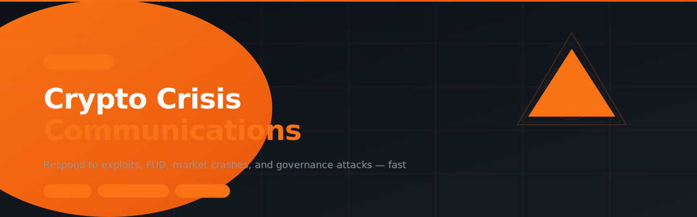

# crypto-crisis-communications



> SKILL.md for AI agents — Respond to exploits, FUD campaigns, token price crashes, governance attacks, and reputational crises in Web3. Includes response templates, escalation frameworks, and a 30-day trust recovery plan.

---

## Install

```
clawhub skill install crypto-crisis-communications
```

Or paste the repo URL directly into your OpenClaw chat and the agent will install it automatically.

---

## What it does

8 modules, all in one skill:

| Module | What it solves |
| --- | --- |
| **Security Incident Response** | First 2-hour playbook, statement templates, and post-mortem structure for exploits |
| **FUD & Misinformation** | Framework to assess, respond to, and neutralize false narratives |
| **Market Crisis Response** | Community messaging during token price crashes without commenting on price |
| **Governance Crisis** | Handle hostile proposals, voting attacks, and community splits |
| **Reputational Crisis** | Team controversy and personal scandal response framework |
| **Media Crisis** | Response ladder for blog posts up to major outlet coverage |
| **Community Conflict** | De-escalation sequence for moderator issues and internal drama |
| **Recovery & Trust Rebuild** | 30-day plan to restore credibility and community confidence post-crisis |

---

## Who it's for

Protocol marketing leads, DAO communication teams, Web3 founders, and community managers who need to communicate clearly and fast when things go wrong.

---

## File structure

```
crypto-crisis-communications/
└── SKILL.md    ← Full skill (8 modules)
```

---

## Built with

- [OpenClaw](https://openclaw.ai)
- [ClawHub](https://clawhub.ai)

---

## License

MIT
